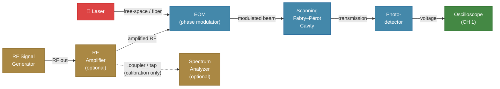
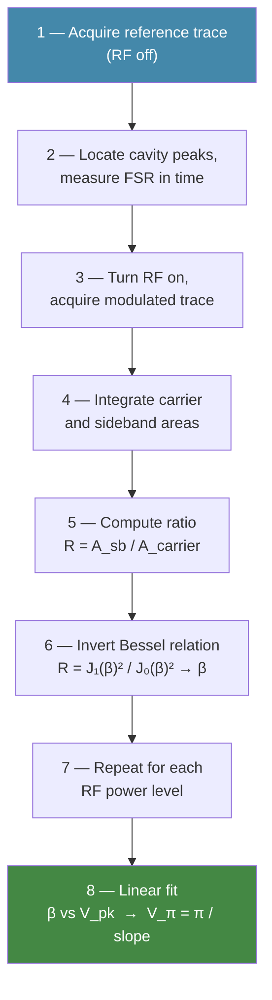
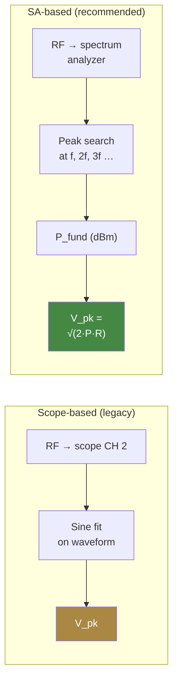

# cavityscope

Toolkit for scanning Fabry-Perot cavity measurements — RF Vpi sweeps, sideband extraction, and modulation-index fitting.

## Structure

```
cavityscope/
├── core/
│   ├── instruments.py      # Generic ScopeInterface / RFSourceInterface protocols
│   ├── config.py           # SweepConfig dataclass with all tuneable parameters
│   └── utils.py            # Shared helpers (dBm conversion, windowing, I/O)
├── analysis/
│   ├── reference.py        # RF-off reference trace analysis (FSR, carrier picking)
│   ├── measurement.py      # Per-trace sideband / carrier integration
│   ├── vpi_fitting.py      # Beta extraction from Bessel ratios, linear Vpi fit
│   └── plotting.py         # Trace + fit plotting
└── sweep.py                # Top-level sweep orchestration (hardware-agnostic)

notebooks/
└── rf_vpi_sweep.ipynb      # Ready-to-run notebook — just plug in your hardware
```

## Measurement setup

The measurement uses a scanning Fabry–Pérot (FP) cavity to resolve the
optical sidebands created by an electro-optic modulator (EOM) driven with
an RF signal generator. An optional spectrum analyzer (SA) can be
inserted into the RF path for power calibration.



| Instrument | Role | Protocol class | Example driver |
|---|---|---|---|
| Oscilloscope | Records cavity transmission trace (time domain) | `ScopeInterface` | `RigolDHO4000` |
| RF signal generator | Drives the EOM at swept frequency and power | `RFSourceInterface` | `WindfreakSynthHD` |
| Spectrum analyzer | Measures actual RF power at the fundamental (calibration) | `SpectrumAnalyzerInterface` | `RigolRSA3000E` |

All instrument access goes through the protocol classes in `core/instruments.py`.
Concrete drivers live in the separate [`hardwarelib`](../hardwarelib) package and
are wired in at notebook level.

## Working principle — Vpi measurement

The half-wave voltage $V_\pi$ is the RF voltage at which the EOM imparts
a phase shift of $\pi$ radians. Since phase modulation creates optical
sidebands whose amplitudes follow Bessel functions of the modulation
index $\beta = \pi V_\text{pk} / V_\pi$, the scanning FP cavity can
resolve those sidebands and give us $\beta$ as a function of applied
voltage — from which $V_\pi$ drops out as a simple linear-fit parameter.



## How Vpi is extracted from the modulation-index fit

The half-wave voltage $V_\pi$ is the voltage at which the electro-optic
phase modulator imparts a phase shift of $\pi$ radians. `cavityscope`
extracts it from cavity transmission traces in four stages.

### 1. Reference trace (RF off)

With the RF drive off, a scope trace of the scanning Fabry–Pérot
transmission is acquired. Peak-finding on the smoothed, baseline-subtracted
signal locates the cavity resonances (carriers). The free spectral range
(FSR) in time, $\Delta t_{\text{FSR}}$, is taken as the median spacing
between adjacent peaks.

### 2. Sideband and carrier integration (RF on)

For each RF power/frequency setting the modulator is driven and a new scope
trace is captured. The first-order sidebands appear at time offsets

$$
\delta t = \Delta t_{\text{FSR}} \cdot \frac{f_{\text{RF}}}{f_{\text{FSR}}}
$$

from the carrier. Integration windows (configurable in Hz, mapped to time
via the FSR) are placed around the carrier and the $\pm 1$ sidebands.
The integrated area of each peak is computed with the trapezoidal rule on
the smoothed trace after baseline subtraction.

### 3. Modulation index (beta) from the Bessel ratio

For a pure phase modulator driven at modulation index $\beta$, the
electric field acquires sidebands whose amplitudes are Bessel functions of
the first kind. The carrier power scales as $J_0(\beta)^2$ and each
first-order sideband as $J_1(\beta)^2$. The measured ratio of sideband
area to carrier area therefore satisfies

$$
R = \frac{A_{\text{sideband}}}{A_{\text{carrier}}} = \frac{J_1(\beta)^2}{J_0(\beta)^2}
$$

This equation is numerically inverted for $\beta$ on the first monotonic
branch $0 < \beta < 2.4048$ (the first zero of $J_0$) using Brent's
root-finding method (`solve_beta_from_ratio` in `vpi_fitting.py`).

Points are excluded from the subsequent fit when:

- the ratio falls outside `[min_ratio_for_beta, max_ratio_for_beta]`,
- the sideband signal-to-noise ratio is below `min_sideband_area_snr`, or
- the root-finder returns no finite solution.

### 4. Linear fit and Vpi extraction

By definition of the half-wave voltage,

$$
\beta = \frac{\pi \cdot V_{\text{pk}}}{V_\pi}
$$

so $\beta$ is linear in the peak drive voltage $V_{\text{pk}}$ with slope
$m = \pi / V_\pi$. A linear fit (with or without intercept, controlled by
`fit_include_intercept`) of the surviving $(\hat{V}_{\text{pk}}, \hat{\beta})$
points yields the slope, from which

$$
V_\pi = \frac{\pi}{m}
$$

The fit quality is reported as $R^2$, and the result is stored per RF
frequency in the `vpi_fit_summary.csv` output.

> **Voltage estimation.** $V_{\text{pk}}$ at the modulator is either
> calculated analytically from the set-point dBm
> ($V_{\text{rms}} = \sqrt{P \cdot R}$, $V_{\text{pk}} = \sqrt{2} \cdot V_{\text{rms}}$)
> or looked up from an optional power-calibration table that maps
> `(power_dbm, frequency_hz)` to measured $V_{\text{pk}}$.

## Power calibration

The modulation index $\beta$ is proportional to the peak voltage
$V_\text{pk}$ at the EOM electrodes, so an accurate estimate of $V_\pi$
requires an accurate estimate of $V_\text{pk}$. Two calibration methods
are implemented; both sweep the same (frequency, power) grid as the main
measurement and build a lookup table
$(\text{frequency}, \text{power setting}) \mapsto V_\text{pk}$.

### Method 1 — Scope-based (legacy)

The RF signal is tapped into a second scope channel. For each grid point
a sine fit extracts $V_\text{pk}$ directly from the time-domain waveform.

**Limitation:** When the signal generator (or amplifier) produces
significant harmonics, the captured waveform is no longer a pure sine.
The fit either over- or under-estimates the fundamental amplitude,
leading to a biased $V_\pi$.

### Method 2 — Spectrum-analyzer-based (recommended)

A spectrum analyzer measures the power in the fundamental tone and each
harmonic ($2f, 3f, \ldots$) separately. The fundamental power
$P_\text{fund}$ is converted to peak voltage:

$$
V_\text{pk} = \sqrt{2\,P_\text{fund}\,R}
$$

where $R$ is the load impedance (typically 50 Ω).

Because the SA resolves each spectral line individually, the measurement
is immune to harmonic distortion.



### Harmonic diagnostics

When using the SA method, `cavityscope` records the power of each
harmonic and computes:

- **THD (%)** — total harmonic distortion relative to the fundamental.
- **dBc levels** — each harmonic's power relative to the fundamental.
  Below −30 dBc is negligible; above −20 dBc indicates significant
  nonlinearity in the amplifier chain.
- **Fundamental power fraction** — what share of total output power is
  in the tone the modulator actually responds to.

These diagnostics are saved as CSVs and plots in the calibration output
folder so you can judge amplifier linearity at a glance.

### Calibration lookup

The resulting calibration table is stored in a `PowerCalibration` object
that maps any `(power_dbm, frequency_hz)` query to a $V_\text{pk}$ via
per-frequency linear interpolation. During the main sweep, each
measurement point's $V_\text{pk}$ is looked up from this table instead
of being computed analytically from the dBm set-point.

## Design principles

- **Hardware is generic in the library.** The sweep and analysis code depend only on `ScopeInterface` and `RFSourceInterface` (Python `Protocol` classes). Concrete drivers live in the separate [`hardwarelib`](../hardwarelib) package.
- **Specific devices are wired in at notebook level.** The Jupyter notebook imports the concrete driver (e.g. `RigolDHO4000`, `WindfreakSynthHD`) and passes it to the sweep runner. Swapping to a different scope or signal generator requires changing only the import and one constructor call.
- **Configuration is a dataclass.** All parameters live in `SweepConfig`, which has sensible defaults and serialises to JSON.

## Installation

```bash
# Install hardwarelib first (editable)
pip install -e ../hardwarelib

# Then install cavityscope
pip install -e .
```

## Quick start

Open `notebooks/rf_vpi_sweep.ipynb`, set your instrument addresses, and run all cells.

Or from a script:

```python
from hardwarelib.oscilloscopes.rigol import RigolDHO4000
from hardwarelib.signal_generators.windfreak import WindfreakSynthHD
from cavityscope.core import SweepConfig
from cavityscope.sweep import run_sweep

scope = RigolDHO4000("TCPIP0::192.168.1.50::INSTR")
rf = WindfreakSynthHD("COM12", channel=0)

scope.open()
rf.open()
try:
    data = run_sweep(scope, rf, SweepConfig())
finally:
    rf.set_output(False)
    rf.close()
    scope.close()
```
